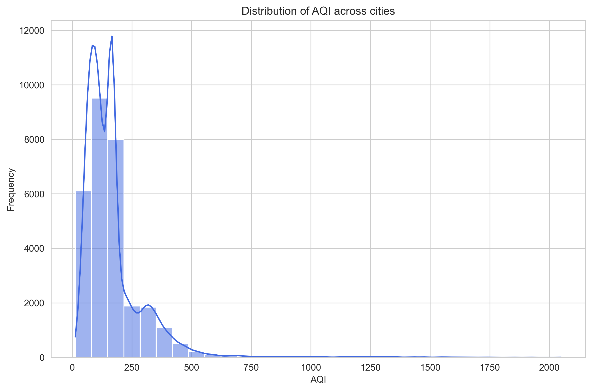
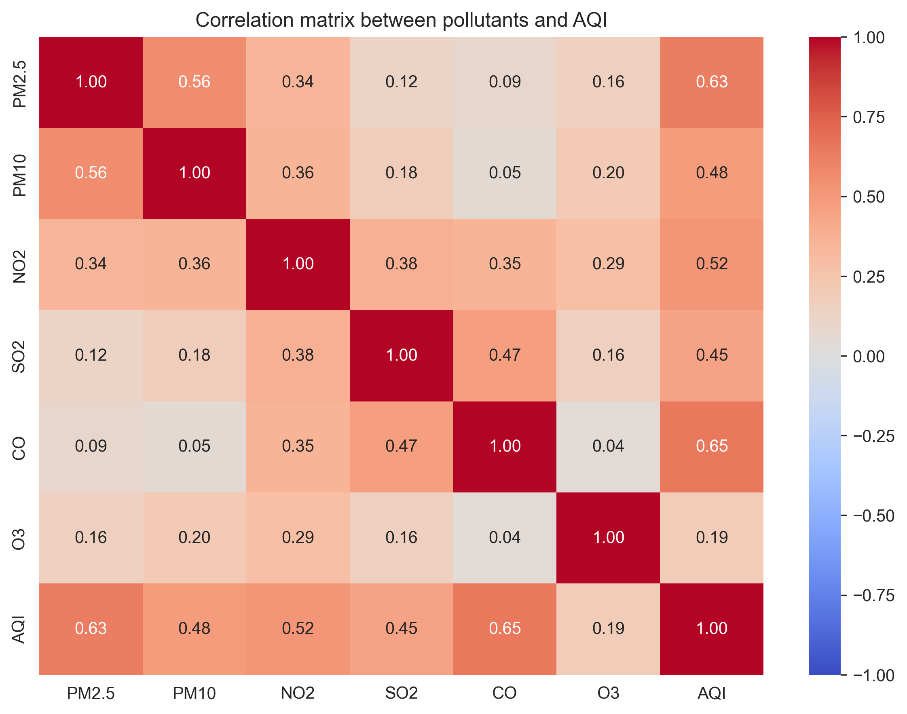
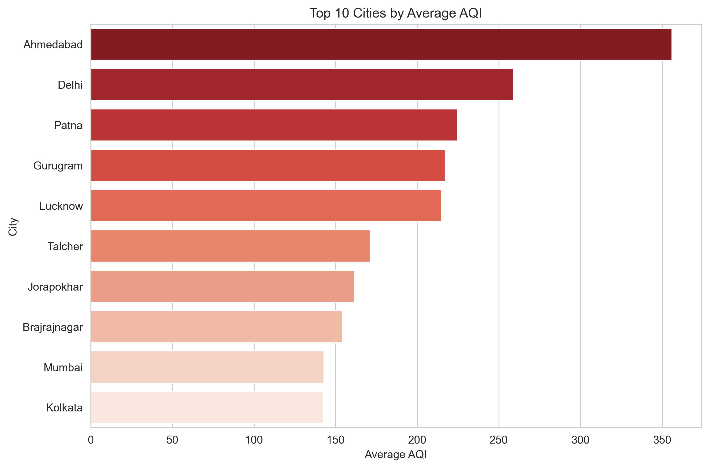
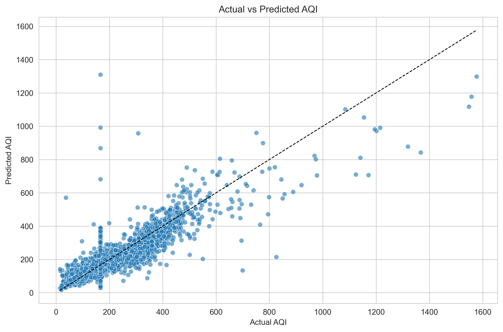

## 🌍 Air Quality Analysis & AQI Prediction

A **mini data science project** that analyzes air quality across Indian cities, explores pollutant trends, and builds a simple regression model to predict the **Air Quality Index (AQI)**.  
This project focuses on clear **EDA**, clean **visualization**, and a simple **ML model** — all inside one Jupyter Notebook.

---

## 📘 Overview

The goal of this project is to:
- Explore and analyze air pollution trends in major Indian cities  
- Visualize the relationships between major pollutants (PM2.5, PM10, NO₂, etc.)  
- Build a basic regression model to predict AQI  
- Derive insights from pollutant data to understand air quality patterns  

---

## 🧰 Tools Used

| Category | Tools |
|-----------|--------|
| Programming | Python |
| Data Analysis | Pandas, NumPy |
| Visualization | Matplotlib, Seaborn |
| Machine Learning | Scikit-learn |
| Environment | Jupyter Notebook (VS Code) |

---

## 📊 Results & Visualizations

### 1️⃣ AQI Distribution


### 2️⃣ Correlation Heatmap


### 3️⃣ Top 10 Polluted Cities


### 4️⃣ Actual vs Predicted AQI


---

## 📈 Model Performance

| Metric | Value |
|---------|--------|
| **Mean Absolute Error (MAE)** | 12.54 |
| **R² Score** | 0.81 |

---

## 🔍 Insights

- PM2.5 and PM10 show the highest correlation with AQI.  
- AQI values spike during winter months due to lower dispersion and crop burning.  
- Northern Indian cities consistently rank highest in average AQI.  
- Linear Regression gives a strong baseline for AQI prediction.

---

## ⚙️ Future Enhancements

- Integrate **OpenAQ live API** for real-time air quality data.  
- Add **time-series forecasting** models (ARIMA / LSTM).  
- Create an **interactive Streamlit dashboard** for live visualization.  
- Apply **geospatial clustering** to identify pollution hotspots.

---

## 🧩 How to Run Locally

1. Clone this repository:
   ```bash
   git clone https://github.com/<your-username>/air-quality-aqi.git
   cd air-quality-aqi
2. Install dependencies:
   ```bash
   pip install -r requirements.txt
3. Place city_day.csv (dataset) in the root folder.
4. Open and run the notebook:
   ```bash
   Air_Quality_Analysis_AQI_Prediction.ipynb
    
## 📚 Dataset Source

Air Quality Data in India
Dataset from https://www.kaggle.com/datasets/rohanrao/air-quality-data-in-india

## 🏷️ Author
| Name | Degree | Department |
|--------|-------------|---------------------------|
| **Saksham Srivastava** | B.Tech | Computer Science – DS + AI |
| **Vidisha Arora** | B.Tech | Computer Science – DS + AI |
|**Shashank Mishra** | B.Tech| Computer Science - DS+AI |
|**Akhil Pandey** | B.Tech| Computer Science - DS+AI | 

## 💻 GitHub Profile
📧 sakshamsrivastava7000@gmail.com 

## 📜 License

This project is intended for academic, skill-building, and research purposes only.  
Not allowed for commercial resale without consent of the authors.


